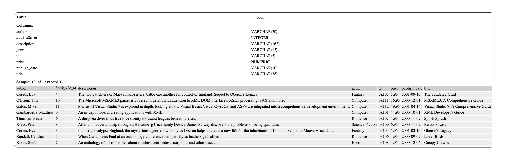

# Getting started

The utility should be simple to run, however like all things it depends on your experience. What follows is a guide that assumes you have some basic technical knowledge (otherwise you really ought not to be deconstructing XML files)

I work on a Mac and various Linux platforms, whilst there is no reason for things not to work on Windows machine your mileage may vary and I don't want/have access to a machine to be able to help you.

## Get ready

This is a command line utility. So you will need to be able to access the command line through Terminal or some equivalent terminal programme

The software is stored in GitHub and requires 'git' to check it out unless you use the download option. I make use of the GitHub Desktop application

The software is developed using the Perl languauge:

   * Linux - this will normally be installed and of a sufficiently recent version to run the code. Use 'yum' or 'apt-get' to add/update as appropriate to your environment
   * Mac - I would *strongly* advise the use of [ActivePerl](https://www.activestate.com/products/perl/downloads/) rather than the default version installed. This is also what is used for the development of the utility

If you want diagrams then you must have [Graphviz](https://www.graphviz.org/download/) installed. If you want the diagrammer software to work then you must have this installed and available via your PATH.
   
## Get going

   * Get the code:
   
`git clone https://github.com/datamgmt/xml2csv.git `
   
   * Change into the working directory

`cd xml2csv`

   * Set up the environment (**Note**: There is a space between the dot '.' and the command
   
`. bin/setenv`

   * Add the required CPAN libraries. This script requires elevated permissions to install some standard libraries from CPAN. If you already have the required libraries this script will effectively do nothing
      
`sudo update_cpan`
      
## Running the code for the first time

The [Microsoft book.xml](https://docs.microsoft.com/en-us/previous-versions/windows/desktop/ms762271(v%3Dvs.85)) sample file is included with the repository so we will use that to start

   * To run the code type
   
`xml2csv.pl`
 
   * **Note:** If you chose not to install 'Graphviz' then use this command instead
   
`xml2csv.pl --diagram_type=none`
          
If everything works you should see something like this:

> Input file 'examples/xml/books.xml' is 4286 bytes long
> Reading input file 'examples/xml/books.xml'
> Reading complete
> Flattening XML into an array
> Flattening completed
> Merging XML Records
> Merging completed
> Drawing diagram file 'diagram.dot'
> Drawing complete
> Outputing files to directory 'output'
> Outputing complete

If not then please check all the pre-reqs above.

## What's happened?

The program has done the following

 * Read the config file
 * Read the XML file
 * Parsed the XML 
 * Created a set of csv files in a directory called 'output'
 * Created a set of DDL and Load scripts for the postgres database in the same directory
 * Created a diagram like the one below in a file called diagram.dot.pdf showing the structure and some sample data if Graphviz was installed
 
 
 
## Next steps
 
 You will want to try this on your own files, see what the command line options, etc. do so here are some tips:
 
  * To run your own xml file through the system do
  
`xml2csv.pl --load_xml_file=PATH_TO_YOUR_FILE` 

* To see what options are available from the command line (there are a lot, it's very flexible) see

[Command Line Options](../documentation/Options.md)

* To see a series of examples and how the options affect the outcome and understand the examples script see

[Examples](../documentation/Examples.md)